# SMWC Waiting and Catalog Intake Automation Plan

## Current State Summary

### SMWC Waiting Pipeline
- **[smwcw_waiting_compare.js](jstools/smwcw_waiting_compare.js)**: Compares SMWC Waiting ROMs with `rhdata.db`, outputs `waiting_needed.json`, `waiting_queue.json`, `waiting_processed.json` to `smwc_world/`
- **[smwcw_waiting_fetchmissing.js](jstools/smwcw_waiting_fetchmissing.js)**: Downloads games from `waiting_queue.json`, extracts BPS from ZIPs, creates index JSONs in `smwc_world/bpsindex/`, wrap-up JSONs in `smwc_world/games/`, BPS in `smwc_world/bps/`
- **[enter.py](jstools/smwc_world/enter.py)**: Must be run manually with CWD `smwc_world/` per GameID to create `upload/waiting_<GAMEID>.7z` (games JSON + bpsindex + bps + images)
- **Upload**: Manual upload to ArWeave, IPFS, Pixeldrain; manual move from `upload/` to `upload/done/` after verification
- **Important**: `upload/done/` is ephemeral — an external process (outside our control) expires/removes old files. We must never re-execute (build 7z, upload) on games that were previously completed, even after their files are gone.

### General Intake (from [name_72hoqldc2.py](pytools/name_72hoqldc2.py))
- Preparation Process: BPS filename enrichment (e.g., `72hoQLDC_1234_authorname.bps` -> full metadata filename)
- Intake Steps 1-10: `process_arcsfc_runner.js` (not used for Waiting), manual 7z creation, `process_index7zs.js`, IPFS add, ArDrive upload, `search_build1/2.js`, `update_bpsarchives.js`, manifest bump, `verify_bpsarchives.js`
- **Waiting path skips** `process_arcsfc_runner.js`; `smwcw_waiting_fetchmissing` already produces equivalent/better metadata from SMWC API

---

## Part 1: SMWC Waiting Periodic Script and 7z Automation

### 1.1 Waiting Periodic Runner Script
**New script**: `jstools/smwcw_waiting_periodic.js`

- Run in sequence:
  1. `smwcw_waiting_compare.js` (requires `SMWC_QUERY_A_WAITING` env)
  2. `smwcw_waiting_fetchmissing.js`
- After fetchmissing: for each game in `waiting_processed.json` (games with `games/<GAMEID>.json`) that does **not** appear in the **persistent completed registry** (see 1.2), invoke 7z creation. Do NOT rely on presence of files in `upload/done/` — those are expired externally.
- Options: `--dry-run`, `--skip-compare`, `--skip-fetch`, `--only-build-7z`, `--max-games N`
- Output: Log to `smwc_world/periodic_log_YYYYMMDD.txt`, summary (processed/skipped/failed)

### 1.2 Automate 7z Creation (Replace enter.py)
**New script**: `jstools/smwcw_waiting_build7z.js` (or extend `smwcw_waiting_periodic.js`)

- Logic: For each `games/<GAMEID>.json`, build `upload/waiting_<GAMEID>.7z` containing:
  - `games/<GAMEID>.json`
  - `bpsindex/<hash>.json` for each `json_files` entry
  - `bps/<hash>.bps` for each `bps_files` entry
  - `images/<GAMEID>/*` for each `screenshot_files`
- Use `node-7z` or `node-7z-archive` (or spawn `7z`) for Node; or keep `enter.py` and call it from Node with `cwd: smwc_world`, passing GameID as arg
- **Persistent completed registry** (critical): `smwc_world/waiting_packages_completed.json` — append-only list of GameIDs that have been fully handled (built, uploaded, moved to done). This is the **source of truth** for "do not reprocess". Never re-build or re-upload for GameIDs in this registry, even if files in `upload/done/` have been expired/removed externally.
- Transient state: `upload/waiting_packages_state.json` — `{ "built": ["12345"], "uploaded": ["12345"] }` for in-progress tracking; completed GameIDs are moved to the persistent registry and removed from transient state.

### 1.3 Upload Queue and Automation
- **State file**: `smwc_world/upload/upload_state.json` — per 7z: `{ "file": "waiting_12345.7z", "ipfs_cid": null, "ardrive_id": null, "pixeldrain_id": null }`
- **New script**: `jstools/smwcw_waiting_upload.js` — for each 7z in `upload/`:
  - Run `ipfs add --cid-version 1 <file>` (or use `ipfs-only-hash` + external add)
  - Upload to ArDrive (if ardrive-cli/API available)
  - Upload to Pixeldrain (API: https://pixeldrain.com/api/file)
- **Manual vs automated**: Upload to ArWeave/ArDrive often requires auth; Pixeldrain has API. Plan should support:
  - Fully automated for IPFS (local node) and Pixeldrain (API key)
  - Semi-automated for ArWeave/ArDrive (generate commands or call ardrive-cli if configured)
- After verification: move 7z to `upload/done/`, append GameID to **persistent completed registry** (`waiting_packages_completed.json`), remove from transient state. The registry entry persists even after the file in `upload/done/` is expired externally.

### 1.4 Reporting and Records
- Append to `smwc_world/periodic_log_YYYYMMDD.txt`: timestamps, compare/fetch/build/upload results, errors
- Optional: SQLite `smwc_world/waiting_runs.db` with tables `runs`, `games_processed`, `packages_built`, `packages_uploaded`

---

## Part 2: Ad-Hoc Catalog Intake (Contests, One-off, Raw BPS)

### 2.1 BPS Metadata Enrichment Script (Interactive)
**New script**: `jstools/intake_bps_metadata.js` (or `pytools/intake_bps_metadata.py`)

- Input: Directory of BPS files (e.g., contest folder like `72hoQLDC_*.bps`)
- For each BPS: prompt or batch-parse metadata from filename, suggest new filename per [name_72hoqldc2.py](pytools/name_72hoqldc2.py) pattern: `Name by Author [YYYY-MM-DD] (SMW Hack).bps`
- **Interactive mode**: Step through each BPS, show suggested name, allow edit, confirm
- **Batch mode**: Apply regex/pattern to rename; output CSV of `original -> new` for review
- Output: Renamed BPS files (or copy to `enriched/` subdir) + metadata JSON for intake

### 2.2 Ad-Hoc Intake Paths
Three intake paths (all feed into search catalog, not main DB unless promoted):

| Source | Script / Flow | Notes |
|--------|---------------|-------|
| Raw BPS folder | `intake_bps_metadata.js` -> `process_arcsfc_runner.js` (SFC+7z pairs) | Need SFC first: `patch_cwd_bps_files.py` creates SFC+7z from BPS |
| Raw ZIP (BPS + README/Credits) | Extract -> `intake_bps_metadata.js` for BPS, include extras in 7z | Same as above after extraction |
| Raw SFC folder | `process_arcsfc_runner.js` directly | No BPS enrichment; arcsfc creates BPS from SFC |

**New orchestration script**: `jstools/intake_adhoc.js`

- `--input-dir <dir>` — BPS folder, ZIP folder, or SFC folder
- `--mode bps|zip|sfc` — Detects and routes to correct path
- For BPS: optional `--metadata-script` to run enrichment first
- Output: `arcsfcXX_json/`, `arcsfcXX_bps/`, then 7z creation and `process_index7zs.js` integration

### 2.3 Automate Manifest and Archive Creation
**Pain points** (from name_72hoqldc2.py Intake Steps 3-7):

- Manually create 7z batches (~25MB, ~100 hacks each)
- Manually run `process_index7zs.js`
- Manually run `update_bpsarchives.js --add-archive` and `--update-from-ardrive`

**Improvements**:
- **New script**: `jstools/intake_pack_and_index.js`
  - Input: `arcsfcXX_json/`, `arcsfcXX_bps/`
  - Automatically shard into 7z files (~25MB, ~100 items) with unique batch names (e.g., `bpsxc_YYYYMMDD.7z`)
  - Run `process_index7zs.js` with correct args
  - Run `search_build1.js` and `search_build2.js`
  - Generate `update_bpsarchives.js` commands (or call with `--add-archive` for each new 7z)
- **Manifest editing**: Extend `update_bpsarchives.js` to accept batch add (e.g., `--add-archives-from-dir`)

---

## Part 3: Promotion Scripts (Search Catalog -> RHPAK / Main DB)

### 3.1 Promote to RHPAK
**New script**: `jstools/promote_catalog_to_rhpak.js`

- Input: `--item-id <id>` (catalog item_id, e.g., SHA1/SHA256) or `--from-json <path>` (index7z JSON)
- Flow: Same as Electron `catalog:create-rhpak` (see [ipc-handlers.js](electron/ipc-handlers.js) ~17200): load item JSON, build skeleton, call `newgame.handlePackage()`
- Options:
  - `--metadata-file <path>` — Extra JSON to merge into gameversion
  - `--add-screenshots <dir>` — Add screenshots from directory
  - `--output <path>` — Output RHPAK path
- Reuse logic from `lib/blob-creator.js`, `jstools/newgame.js`; run via `enode.sh`

### 3.2 Promote to Main Database
**New script**: `jstools/promote_catalog_to_db.js`

- Input: Same as 3.1
- Flow: Create RHPAK (or use existing), then run `newgame.js --add` (or call `performAddOperation` directly)
- Options:
  - `--metadata-file <path>`
  - `--add-screenshots <dir>`
  - `--skip-rhpak` — If skeleton/JSON already prepared
- Uses `RHDATA_DB_PATH`, `PATCHBIN_DB_PATH` env for non-production DB in tests

---

## File and Directory Layout

```
jstools/
  smwcw_waiting_periodic.js    # Part 1.1
  smwcw_waiting_build7z.js     # Part 1.2
  smwcw_waiting_upload.js      # Part 1.3
  intake_bps_metadata.js       # Part 2.1
  intake_adhoc.js              # Part 2.2
  intake_pack_and_index.js     # Part 2.3
  promote_catalog_to_rhpak.js  # Part 3.1
  promote_catalog_to_db.js     # Part 3.2

jstools/smwc_world/
  waiting_packages_completed.json   # PERSISTENT: GameIDs fully handled (never reprocess)
  upload/
    done/                      # Ephemeral — external process expires old files
    upload_state.json          # Per-file upload status (transient)
  periodic_log_YYYYMMDD.txt    # Run logs
```

---

## Design Principle: Ephemeral upload/done

`upload/done/` is **not permanent storage**. An external process expires/removes old files. Therefore:

- **Persistent registry** (`waiting_packages_completed.json`) is the only source of truth for "this GameID has been fully processed"
- **Never** re-build or re-upload based on "file not found in upload/done" — that may mean it was expired
- **Always** check the registry first; skip any GameID already listed there

---

## Dependencies and Environment

- `SMWC_QUERY_A_WAITING` — Required for smwcw_waiting_compare
- `RHDATA_DB_PATH` — Override for tests
- `PIXELDRAIN_API_KEY` — For automated Pixeldrain upload (if implemented)
- ArDrive: `ardrive-cli` or API; auth handled externally
- IPFS: Local `ipfs` daemon for `ipfs add`
- Python: `py7zr` for enter.py (or migrate to Node 7z)
- `enode.sh` — All node scripts run via enode.sh per project rules

---

## Documentation Updates

- [docs/PROGRAMS.MD](docs/PROGRAMS.MD) — Add all new scripts
- [docs/CHANGELOG.md](docs/CHANGELOG.md) — Summary of new features
- New: `docs/SMWC_WAITING_AUTOMATION.md` — SMWC Waiting pipeline
- New: `docs/ADHOC_INTAKE.md` — Ad-hoc intake flows
- New: `docs/PROMOTE_CATALOG.md` — Promotion scripts usage

---

## Implementation Order Suggestion

1. **smwcw_waiting_build7z.js** — Port enter.py to Node, callable per-GameID
2. **smwcw_waiting_periodic.js** — Orchestrate compare + fetch + build7z, logging
3. **smwcw_waiting_upload.js** — IPFS + Pixeldrain (and optional ArDrive) automation
4. **intake_bps_metadata.js** — Interactive BPS rename + metadata
5. **intake_adhoc.js** — Ad-hoc intake orchestration
6. **intake_pack_and_index.js** — Shard 7z + process_index7zs + manifest
7. **promote_catalog_to_rhpak.js** and **promote_catalog_to_db.js**

---

## Data Flow Diagram

```mermaid
flowchart TB
    subgraph waiting [SMWC Waiting Pipeline]
        A[smwcw_waiting_compare] --> B[smwcw_waiting_fetchmissing]
        B --> C[games/ bps/ bpsindex/]
        C --> D[smwcw_waiting_build7z]
        D --> E[upload/waiting_*.7z]
        E --> F[smwcw_waiting_upload]
        F --> G[upload/done/]
    end

    subgraph adhoc [Ad-Hoc Intake]
        H[Raw BPS/ZIP/SFC] --> I[intake_bps_metadata]
        I --> J[process_arcsfc_runner or patch_cwd]
        J --> K[arcsfcXX_json arcsfcXX_bps]
        K --> L[intake_pack_and_index]
        L --> M[index7z bps7z search_build]
    end

    subgraph promote [Promotion]
        N[rhsearch_cat.db item] --> O[promote_catalog_to_rhpak]
        N --> P[promote_catalog_to_db]
        O --> Q[RHPAK file]
        P --> R[rhdata.db]
    end
```


