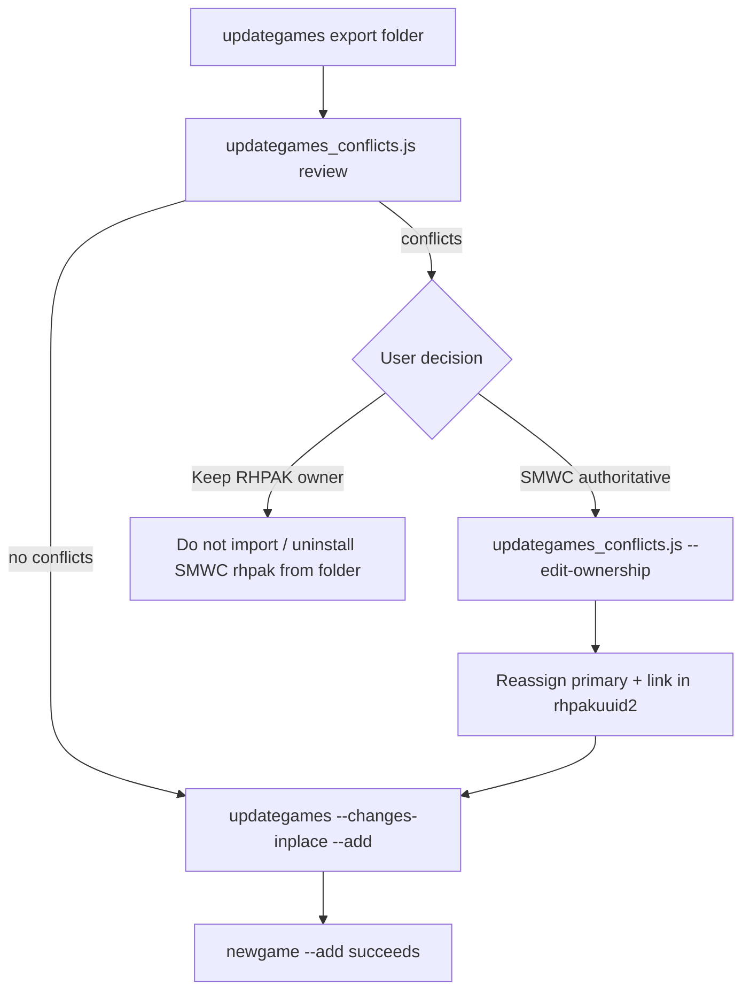

# updategames RHPAK Conflict Review and Multi-Owner Schema

## 1. Problem Summary

### 1.1 What users see

When running `updategames.js` import with `--changes-inplace`, most games succeed on repeat runs. Some fail with errors like:

```
Resource file gimmicks.bps belongs to rhpak ff4d7d10-e8b3-181f-6fa8-74d71a2a5099
and cannot be replaced by 91545e4f-640d-4f55-aa88-9be5662d4ec8.
```

Example: game **40631** fails; game **42356** succeeds with the same command pattern.

### 1.2 Two layers of “existing game” (not the same thing)

| Layer | Where | Meaning |
|-------|-------|---------|
| **Gameid recognition** | `updategames.js` import mode | Row exists in `gameversions` for this `gameid`; in-place update preserves `gvuuid` / `version` |
| **RHPAK ownership** | `newgame.js --add` upsert guards | Each table row is owned by exactly one `rhpakuuid`; a different rhpak cannot replace it |

A game can pass layer 1 and still fail layer 2.

### 1.3 Root cause (40631 case)

1. **Export assigns a new rhpak identity.** When `updategames` builds folder skeletons, it calls `recordCreator.generateUUID()` for `metadata.rhpakuuid` (see `jstools/updategames.js` ~line 1221). Every export batch gets fresh UUIDs.

2. **In-place import does not fully reconcile rhpak identity.** With `--changes-inplace`, `updategames` preserves DB `rhpakuuid` on `gameversion` only when `skeleton.gameversion.rhpakuuid` is falsy. Prepared export folders always have `metadata.rhpakuuid`, `gameversion.rhpakuuid`, and per-resource `rhpakuuid` set — so the DB value is **not** copied in.

3. **`newgame.js` prefers `metadata.rhpakuuid`.** All upsert helpers resolve owner as `(skeleton.metadata.rhpakuuid) || gv.rhpakuuid`.

4. **RHPAK install may own resources under a different UUID.** If an RHPAK was installed earlier, `res_attachments` rows for the patch bytes (`file_sha256`) may reference the RHPAK’s UUID (`ff4d7d10…`) while `gameversions.rhpakuuid` may still match the SMWC export UUID (`91545e4f…`) from a prior import — or rhdata may have been updated in a prior partial run while resource.db was not.

5. **Global resource uniqueness.** `resource.db` has a unique index on `file_sha256`. Ownership checks query by hash globally, not scoped to `gameid`:

```javascript
// jstools/newgame.js upsertPreparedResources
const existing = resourceDb.prepare(
  'SELECT rhpakuuid FROM res_attachments WHERE file_sha256 = ?'
).get(effectiveFileSha256);
if (existing.rhpakuuid && existing.rhpakuuid !== entryRhpak) {
  throw new Error(`Resource file … belongs to rhpak ${existing.rhpakuuid} …`);
}
```

6. **Cross-database transactions.** `performAddOperation` commits `rhdata.db` and `patchbin.db` before `resource.db`. A failure at the resource step can leave rhdata updated but resources unchanged — amplifying split ownership on retry.

### 1.4 Why 42356 succeeds

Same pipeline, but no conflicting row: either no RHPAK was installed for that game, or the existing `res_attachments` row already has the same `rhpakuuid` as the export skeleton. Only the encrypted patch resource is processed (`40631.zip` / `42356.zip` are skipped when they lack fernet payloads).

### 1.5 Current ownership guards (all in `jstools/newgame.js`)

Each upsert checks an existing row by a **natural key** and rejects cross-rhpak replacement:

| Database | Table | Lookup key | Error prefix |
|----------|-------|------------|--------------|
| rhdata.db | `gameversions` | `(gameid, version)` | Existing gameversion … |
| rhdata.db | `gameversion_stats` | `gameid` | Existing gameversion_stats … |
| rhdata.db | `patchblobs` | `patchblob1_name` | Patchblob … |
| rhdata.db | `patchblobs_extended` | `pbuuid` | patchblobs_extended entry … |
| rhdata.db | `rhpatches` | `patch_name` | Patch record … |
| patchbin.db | `attachments` | `file_name` | Attachment … |
| resource.db | `res_attachments` | `file_sha256` | Resource file … |
| screenshot.db | `res_screenshots` | `file_sha256` or `source_url` | Screenshot … / Screenshot URL … |

Rows with `rhpakuuid IS NULL` also cannot be replaced (legacy guard).

### 1.6 Current uninstall behavior (reference for Part B)

`deleteRhpakRecords()` and `removeRecords()` delete all rows where `rhpakuuid = ?` matches the uninstalled package. There is **no** shared-ownership model today — uninstalling an RHPAK removes every row solely tagged with that UUID, even if another RHPAK logically references the same patch bytes.

---

## 2. Tool: `updategames_conflicts.js`

**Location:** `jstools/updategames_conflicts.js`  
**Runner:** always `enode.sh` (never bare `node`).

### 2.1 CLI surface

```
enode.sh jstools/updategames_conflicts.js [options]

Options:
  --source-folder=<path>   Parent folder containing per-game subfolders (like updategames import)
  --subfolders=<list|all>  Comma-separated gameids or "all" (requires --source-folder)
  --game-folder=<path>     Single game folder (e.g. games20260618/40631)
  --edit-ownership         Interactive: prompt to reassign primary owner per conflict
  --dry-run                With --edit-ownership: show prompts but do not write DB
  --yes-all                Skip per-item prompts (approve all); use with care
  --help

Environment (same as updategames / newgame):
  RHDATA_DB_PATH, PATCHBIN_DB_PATH, RESOURCE_DB_PATH, SCREENSHOT_DB_PATH
```

**Examples:**

```bash
enode.sh jstools/updategames_conflicts.js --source-folder=games20260618 --subfolders=40631
enode.sh jstools/updategames_conflicts.js --game-folder=games20260618/42356
enode.sh jstools/updategames_conflicts.js --game-folder=games20260618/40631 --edit-ownership
```

List in `docs/PROGRAMS.MD` when implemented.

### 2.2 Shared module layout

Extract conflict-detection logic into a reusable module so `updategames.js` can optionally warn before import:

```
lib/rhpak-conflict-checker.js
  loadImportSkeleton(gameFolder)       → skeleton + baseDir
  ensurePrepared(skeletonPath)         → run --prepare if metadata.prepared is false
  resolveIncomingRhpak(skeleton)       → metadata.rhpakuuid || gameversion.rhpakuuid
  detectConflicts(dbs, skeleton, baseDir) → ConflictReport[]
  applyOwnershipChange(dbs, change, options) → applied summary
```

`ConflictReport` shape (per conflict):

```javascript
{
  gameid: '40631',
  table: 'res_attachments',           // qualified: 'resource.res_attachments'
  naturalKey: { file_sha256: 'f0334c…' },
  rowId: { rauuid: '…' },             // primary key columns for the existing row
  fileName: 'gimmicks.bps',           // human label when available
  dbOwner: 'ff4d7d10-e8b3-181f-6fa8-74d71a2a5099',
  dbOwnerName: '…',                   // from rhpaks.name when present
  dbOwnerIsSystem: null,              // after is_system migration
  incomingOwner: '91545e4f-640d-4f55-aa88-9be5662d4ec8',
  incomingOwnerName: '40631 - …',
  incomingSource: 'games20260618/40631/40631.json',
  conflictType: 'cross_rhpak',        // cross_rhpak | legacy_null_owner
  wouldBlockAdd: true                 // matches newgame.js throw sites
}
```

### 2. Part A — Review mode (default)

For each requested game folder:

1. Resolve `{gameid}.json` skeleton path.
2. If `!metadata.prepared`, run `enode.sh jstools/newgame.js "<skeleton>" --prepare` (same as import mode).
3. Load latest `gameversions` row for `gameid` (if any).
4. Build **incoming artifact descriptors** mirroring `newgame.js --add`:
   - Patch artifact via `loadPreparedPatchArtifact` (or equivalent read-only path).
   - Resource payloads: entries with `fernet_key` + `encrypted_data_path` (skip zip-only resources).
   - Screenshot payloads: file and URL entries.
5. For each guarded table, compare DB owner vs incoming owner using the **same natural keys** as `newgame.js`.
6. Print a structured report:

```
[40631] RHPAK conflict report
  Incoming rhpak: 91545e4f-640d-4f55-aa88-9be5662d4ec8  (40631 - Jeffw - Really Neat Gimmicks - 1)
  DB gameversion rhpak: 91545e4f-640d-4f55-aa88-9be5662d4ec8  (match)

  CONFLICTS (would block updategames --add):
  1. resource.res_attachments
     file: gimmicks.bps
     key:  file_sha256=f0334c2c72d794db837afef5463161ac80e593db83b485bde2ce191ea3377f6f
     db owner:       ff4d7d10-e8b3-181f-6fa8-74d71a2a5099  (installed RHPAK)
     incoming owner: 91545e4f-640d-4f55-aa88-9be5662d4ec8  (SMWC export)

  Summary: 1 blocking conflict(s), 0 warnings
```

7. Exit code: `0` if no blocking conflicts, `1` if any, `2` on script error.

**Non-blocking informational lines** (warnings, not conflicts):

- Incoming rhpak differs from DB `gameversions.rhpakuuid` but no row exists yet at guarded keys (unlikely).
- Skeleton rhpak differs from DB but all guarded lookups are empty (new game).
- Orphan RHPAK UUID in DB not present in `rhpaks` table.

### 2.4 Part C — `--edit-ownership` (interactive reassignment)

Runs review first. For each blocking conflict, prompt on **stdin**:

```
Conflict 1/1: resource.res_attachments  gimmicks.bps
  DB owner:       ff4d7d10-e8b3-181f-6fa8-74d71a2a5099
  Incoming owner: 91545e4f-640d-4f55-aa88-9be5662d4ec8
Change primary owner to incoming rhpak? [y/N/a/q] (a=all, q=quit):
```

- **`y`**: apply this change.
- **`N`**: skip.
- **`a`**: approve all remaining (same session).
- **`q`**: stop; leave prior approved changes committed (each change in its own transaction).

**Apply semantics — Phase 1 (current schema, before `rhpakuuid2` migration):**

Update the existing row’s `rhpakuuid` to `incomingOwner` for that natural key. This is a blunt reassignment: the previous RHPAK loses sole ownership; uninstall of the old RHPAK may leave dangling references until Part B is implemented.

**Apply semantics — Phase 2 (after `rhpakuuid2` migration):**

For each approved conflict on a row that supports `rhpakuuid2`:

1. Parse existing `rhpakuuid2` JSON array (default `[]`).
2. Build new list: `[incomingOwner, …previous owners excluding incomingOwner, in stable order]`.
3. Set `rhpakuuid = incomingOwner` (first element = primary owner).
4. Set `rhpakuuid2 = JSON.stringify(newList)`.
5. Ensure both RHPAKs exist in `rhpaks` (insert stub row if missing, with appropriate `is_system`).

Also reassign **related rows for the same gameid** when the conflict is on a core identity row (gameversion, stats) so rhdata stays consistent — optionally prompt as a group:

```
Also update 4 related rows (patchblobs, attachments, …) to incoming owner? [Y/n]:
```

**Safety:**

- Require TTY for prompts unless `--yes-all` (document danger).
- `--dry-run` prints would-be SQL / row updates without writing.
- Log all changes to stdout; optional `--log-file=path`.
- Do **not** call `newgame.js --add` automatically after edit; user re-runs `updategames` import when satisfied.

### 2.5 Tests (`tests/test_updategames_conflicts.js`)

Minimum three cases using env-var non-production DB paths:

1. **No conflict** — incoming rhpak matches DB owner on patch resource sha256.
2. **Cross-rhpak resource conflict** — existing `res_attachments` row with different `rhpakuuid`; review exits 1.
3. **`--edit-ownership` with `--yes-all`** — reassignment allows subsequent conflict check to pass.

Include in centralized test runner.

---

## 3. Part B — Schema extension: `rhpakuuid2` and `is_system`

### 3.1 Design goals

- **`rhpakuuid`**: primary owner (first authority for upsert guards and display).
- **`rhpakuuid2`**: JSON array of UUID strings — all RHPAKs that reference this logical record. **First element MUST equal `rhpakuuid`** when both are set.
- **Shared resources:** two installed RHPAKs may reference the same patch hash or gameversion; uninstall removes only themselves from `rhpakuuid2`, and deletes the row only when the list becomes empty.
- **`is_system` on `rhpaks`:** distinguishes SMWC/updategames system RHPAKs from user-installed packages.

### 3.2 `rhpakuuid2` column

| Property | Value |
|----------|-------|
| Type | `TEXT` |
| Format | JSON array of UUID strings, e.g. `["91545e4f-640d-4f55-aa88-9be5662d4ec8","ff4d7d10-e8b3-181f-6fa8-74d71a2a5099"]` |
| Nullable | Yes (legacy rows); treat NULL as `[rhpakuuid]` when `rhpakuuid` is set |
| Primary owner rule | `rhpakuuid === JSON.parse(rhpakuuid2)[0]` when both non-null |

**Initial backfill (migration):**

```sql
UPDATE <table>
SET rhpakuuid2 = json_array(rhpakuuid)
WHERE rhpakuuid IS NOT NULL
  AND (rhpakuuid2 IS NULL OR rhpakuuid2 = '');
```

(User spec typo corrected: initial value mirrors **`rhpakuuid`**, not rhpakuuid2.)

### 3.3 Tables receiving `rhpakuuid2`

Only tables that participate in **single-row-per-logical-key** RHPAK ownership (same set as current guards):

| DB | Table | Uniqueness / guard key |
|----|-------|-------------------------|
| rhdata.db | `gameversions` | `(gameid, version)` — one current version row per gameid+version |
| rhdata.db | `gameversion_stats` | `gameid` |
| rhdata.db | `patchblobs` | `patchblob1_name` |
| rhdata.db | `patchblobs_extended` | `pbuuid` |
| rhdata.db | `rhpatches` | `patch_name` |
| rhdata.db | `gamestages` | `(gameid, levelnumber, playlevel_patch_code)` — one stage slot per level identity; confirm exact key matches product rules |
| patchbin.db | `attachments` | `file_name` |
| resource.db | `res_attachments` | `file_sha256` (global) |
| screenshot.db | `res_screenshots` | `file_sha256` and/or `source_url` (file vs URL rows) |

**Not on `rhpaks` itself** — that table is the registry; it gets `is_system` instead.

**Helper module:** `lib/rhpak-ownership.js`

```javascript
parseRhpakuuid2(text, fallbackRhpakuuid) → string[]
formatRhpakuuid2(uuids) → string
setPrimaryOwner(current, newPrimary) → { rhpakuuid, rhpakuuid2 }
addSecondaryOwner(current, uuid) → { rhpakuuid, rhpakuuid2 }
removeOwner(current, uuidToRemove) → { rhpakuuid, rhpakuuid2, shouldDeleteRow }
ownersConflict(existingOwners, incomingUuid) → boolean
```

### 3.4 `is_system` on `rhpaks`

| Property | Value |
|----------|-------|
| Column | `is_system INTEGER NOT NULL DEFAULT 0` |
| `1` | RHPAKs created by `updategames` export/import, or `newgame.js --add` / `--prepare` when `--is-system` passed |
| `0` | RHPAKs installed via `--import` / `.rhpak` install (default from now on) |

**Population rules:**

| Code path | `is_system` |
|-----------|-------------|
| `updategames.js` folder export (`generateUUID` metadata) | `1` |
| `newgame.js --add` from updategames skeleton | `1` (propagate from skeleton metadata flag) |
| `newgame.js --import` / RHPAK package install | `0` |
| `newgame.js --add` with CLI `--is-system` | `1` |
| Migration backfill | `0` for all existing rows (conservative); optional follow-up script to mark known SMWC UUIDs |

Add `metadata.is_system` on prepared skeletons from updategames export.

### 3.5 Revised upsert guard logic (after migration)

Replace strict inequality throw with:

```javascript
const owners = parseRhpakuuid2(existing.rhpakuuid2, existing.rhpakuuid);
if (owners.includes(incomingRhpak)) {
  // Same pack or already linked — allow upsert / update metadata
} else if (options.allowLink || options.forceOwnership) {
  // Admin/tool path: add incoming to rhpakuuid2, optionally set primary
} else {
  throw new Error(…);  // current behavior for normal --add
}
```

Normal `updategames` / `newgame --add` keeps **fail-closed** behavior until user runs `updategames_conflicts.js --edit-ownership` or a future `--link-rhpak` flag.

### 3.6 Revised uninstall logic

For each table with `rhpakuuid2`:

1. Select rows where `rhpakuuid2` JSON array **contains** the UUID being uninstalled (or `rhpakuuid = uuid` for legacy rows).
2. For each row:
   - Remove UUID from array.
   - If array empty → **DELETE** row (and staged files if policy says so).
   - If array non-empty and removed UUID was `rhpakuuid` → promote `rhpakuuid = array[0]`.
   - Else → update `rhpakuuid2` only.
3. Delete `rhpaks` registry row for uninstalled UUID if no rows reference it in any `rhpakuuid2` list.

Implement in `deleteRhpakRecords()` / `removeRecords()` in `newgame.js`; add tests before enabling in production.

### 3.7 Migration checklist (when implementing)

1. Add SQL migrations per database in `electron/sql/migrations/` and register in `jsutils/migratedb.js`.
2. Document in `docs/SCHEMACHANGES.md` (date, rationale, tables).
3. Append backfill commands to `docs/DBMIGRATE.md`.
4. Update `jstools/newgame.js` upsert/uninstall paths.
5. Update `updategames_conflicts.js` Phase 2 apply path.
6. Brief entry in `docs/CHANGELOG.md`.

Suggested migration IDs:

- `rhdata_XXX_rhpakuuid2_multi_owner.sql`
- `patchbin_XXX_rhpakuuid2.sql`
- `resource_XXX_rhpakuuid2.sql`
- `screenshot_XXX_rhpakuuid2.sql`
- `rhdata_XXX_rhpaks_is_system.sql`

---

## 4. End-to-end workflow (target state)



---

## 5. Implementation phases

| Phase | Deliverable | Depends on |
|-------|-------------|------------|
| **0** | This document | — |
| **1** | `lib/rhpak-conflict-checker.js` + `updategames_conflicts.js` review mode | — |
| **2** | `--edit-ownership` Phase 1 (reassign `rhpakuuid` only) + tests | Phase 1 |
| **3** | Schema: `rhpakuuid2` + backfill + `is_system` + migrations docs | — |
| **4** | Update `newgame.js` upsert/uninstall for multi-owner | Phase 3 |
| **5** | `--edit-ownership` Phase 2 (rhpakuuid2-aware linking) | Phases 2, 4 |
| **6** | Optional: `updategames.js --check-conflicts` preflight flag | Phase 1 |

---

## 6. Open questions

1. **gamestages key:** Confirm uniqueness as `(gameid, levelnumber, playlevel_patch_code)` vs `(gvuuid, levelnumber)` for conflict reporting.
2. **Group prompts:** When reassigning gameversion owner, auto-include patchblob/attachment/resources in one approval vs separate prompts per row.
3. **System RHPAK precedence:** When SMWC (`is_system=1`) conflicts with user RHPAK (`is_system=0`), should review mode recommend SMWC as default in the prompt?
4. **rhpaks stub rows:** When linking an incoming export UUID not yet in `rhpaks`, auto-insert with `is_system=1` and skeleton `rhpakname`.
5. **Partial run repair:** One-shot admin command to scan for split ownership (rhdata vs resource rhpak mismatch) across all gameids.

---

## 7. Related files

| File | Role |
|------|------|
| `jstools/updategames.js` | Export UUID generation, in-place import, calls `newgame.js --add` |
| `jstools/newgame.js` | Ownership guards, upsert, uninstall |
| `jstools/updategames_conflicts.js` | **Planned** review + edit tool |
| `lib/rhpak-conflict-checker.js` | **Planned** shared detection |
| `lib/rhpak-ownership.js` | **Planned** rhpakuuid2 helpers |
| `jsutils/migratedb.js` | Migration registration |
| `electron/sql/migrations/resource_001_create_res_attachments.sql` | Unique index on `file_sha256` |

---

## 8. References

- Prior investigation: game 40631 vs 42356 import behavior (conversation 2026-06-21).
- Ownership throw sites: `jstools/newgame.js` lines ~2676, 2745, 2818, 2859, 2891, 3040, 3152, 3287, 3327.
- Uninstall: `deleteRhpakRecords()` ~3431, `removeRecords()` ~3352.
